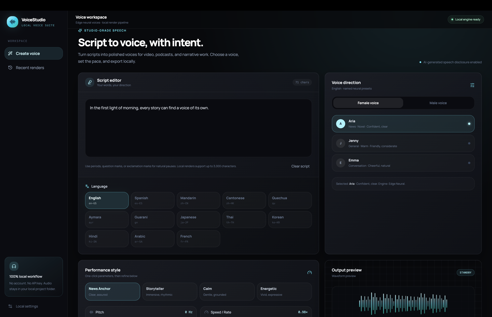
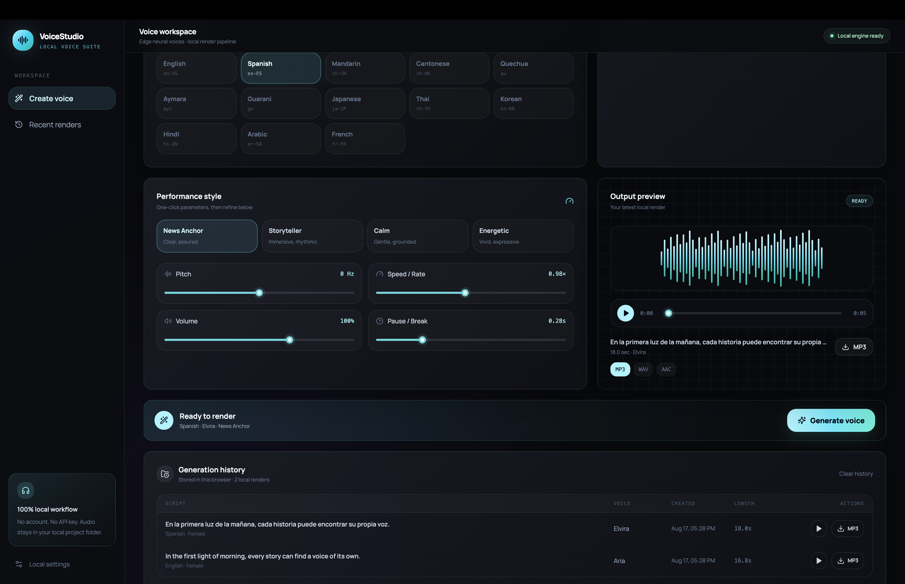

# VoiceStudio — Local Multilingual TTS Studio

VoiceStudio is a **local-first text-to-speech workspace** that requires no account or API key. It uses Edge Neural voices, eSpeak NG, and an optional MMS local model to cover Mandarin, English, Cantonese, Spanish, Quechua, Central Aymara, Guarani, Japanese, Thai, Korean, Hindi, Arabic, and French. FFmpeg exports MP3, WAV, and AAC files locally, while the workspace provides gender selection, style presets, parameter controls, browser playback, and local generation history.

To apply this description on GitHub, open the repository page, select the gear icon beside **About**, paste the description above into **Description**, and save. The text is within GitHub's 350-character limit.





*The VoiceStudio workspace: script editing, language and voice selection, parameter controls, and local generation.*

> **Important:** the project is free, open source, and does not require cloud deployment. Speech synthesis still needs network access to the Edge online voice service. It is not an offline TTS engine and should not be represented as a production service with an SLA.

## Requirements

| Dependency | Purpose | macOS setup |
|---|---|---|
| Node.js 22+ | Runs the React app and local server | Install if not already available |
| Python 3.9+ | Runs `edge-tts` | Install if not already available |
| FFmpeg | Creates silence segments and exports WAV/AAC | `brew install ffmpeg` |
| eSpeak NG (optional) | Offline Quechua and Guarani rendering | `brew install espeak-ng` |
| MMS Python stack (optional) | Local Central Aymara neural rendering | `pnpm voice:setup:extended` |

## Quick start

Run the following commands from the project root:

```bash
pnpm install
pnpm voice:setup
pnpm dev
```

The terminal will print a local address, usually `http://localhost:3000`. On the first render, edge-tts retrieves audio online and stores generated files in `local-data/audio/`; this directory is ignored by Git.

## Languages

VoiceStudio supports Mandarin, English, Cantonese, Spanish, Quechua, Central Aymara, Guarani, Japanese, Thai, Korean, Hindi, Arabic, and French. Most languages use Edge Neural voices. Quechua and Guarani require `brew install espeak-ng`; Central Aymara requires `pnpm voice:setup:extended` and downloads its local model on first use. Read the [multilingual support guide](docs/multilingual-support.md) for the engine matrix and the Aymara model's non-commercial license limitation.

## Workflow

Enter a script, select any of the 13 supported languages, and then choose **Female voice** or **Male voice**. The workspace automatically selects the appropriate local engine and exposes named presets where the underlying engine supports them. Choose News Anchor, Storyteller, Calm, or Energetic, then refine Pitch, Speed / Rate, Volume, and Pause / Break with the sliders.

After selecting **Generate voice**, preview the render in the dark player and download it as MP3, WAV, or AAC. Generation metadata is stored in browser `localStorage` and supports replay and repeat downloads.

## Voices and formats

The verified defaults are `zh-CN-XiaoxiaoNeural / zh-CN-YunxiNeural` for Mandarin, `en-US-AriaNeural / en-US-ChristopherNeural` for English, and `zh-HK-HiuMaanNeural / zh-HK-WanLungNeural` for Cantonese. Available Edge voices may change over time.

`edge-tts` produces MP3 natively. VoiceStudio uses FFmpeg locally to convert MP3 to WAV and AAC, and inserts the selected pause duration between text segments.

## Verification

```bash
pnpm test
pnpm check
```

The test suite covers the 13-language voice catalog, style presets, request validation, Edge Neural and eSpeak NG rendering, plus MP3/WAV/AAC export. A separate opt-in MMS integration test verifies the locally downloaded Central Aymara model.

## References

- [edge-tts](https://github.com/rany2/edge-tts)
- [FFmpeg](https://ffmpeg.org/)
- [Local TTS decision](docs/local-tts-decision.md)
- [Local architecture](docs/local-architecture.md)
- [Multilingual support](docs/multilingual-support.md)
- [Open-source deployment and GitHub publishing guide](docs/OPEN_SOURCE_DEPLOYMENT_GUIDE.md)

## Open-source collaboration

This project uses the [MIT License](LICENSE). Read the [contribution guide](CONTRIBUTING.md), [security policy](SECURITY.md), and [open-source deployment and GitHub publishing guide](docs/OPEN_SOURCE_DEPLOYMENT_GUIDE.md) before contributing.
