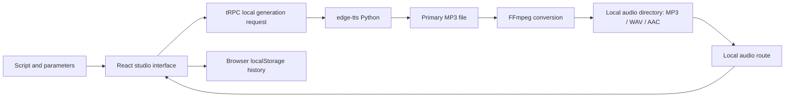

# VoiceStudio local architecture

## Runtime model

VoiceStudio is a local web application. The Node.js service supplies the interface and local API, Python `edge-tts` calls the online voice service, and FFmpeg handles audio conversion. The default workflow does not require a database, cloud storage, an account, or an API key.

## Data model

Each synthesis request includes text, language, voice ID, gender, style, pitch, rate, volume, and pause duration. The server returns an unpredictable local file ID and MP3, WAV, and AAC resource URLs. The browser saves only metadata and these URLs in `localStorage` for recent replay and download history; audio bytes remain under the local project directory at `local-data/audio`.

## Parameter mapping

| UI setting | Server mapping | Notes |
|---|---|---|
| Speed / Rate | edge-tts `--rate` percentage | 1.00 is neutral |
| Pitch | edge-tts `--pitch` in hertz | 0 Hz is neutral |
| Volume | edge-tts `--volume` percentage | 100% is the source volume |
| Pause | Split text into segments and insert silence | FFmpeg preserves the selected interval |

## Security and portability

The server launches local executables through argument arrays and never shell-concatenates user text. Random IDs generate audio file names, and exports stay inside the local project directory. At startup or generation time, the project checks for `edge-tts` in `.venv` and system `ffmpeg`, returning a clear local setup message when a dependency is missing.
